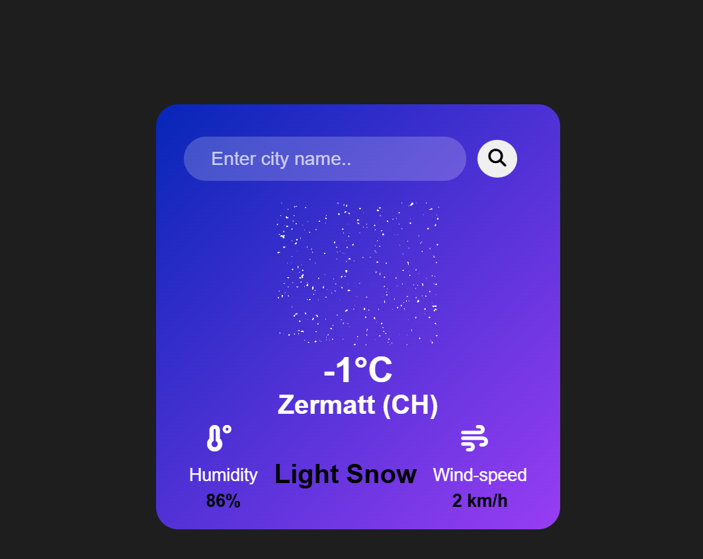

# Weather App 🌤️

A modern, responsive, and interactive weather app that allows users to check real-time weather information for any city in the world. Displays temperature, humidity, wind speed, weather description, and dynamic weather animations (rain, snow, clouds, sun) based on the current climate.

## 📸Screenshot

## 💫Features

- Search for any city worldwide. 🌎

- Displays temperature in °C. 🌡️

- Shows humidity and wind speed. 💧💨

- Weather description with dynamic GIFs/animations. 🎬

- Responsive design for desktop and mobile. 📱💻

- Smooth fade-in effects for GIFs. ✨

## live project :
[click here to try it](https://codebygunjan.github.io/Weather-App/)

## 🪧Demo

Clone the repository:

git clone https://github.com/codebygunjan/weather-app.git

Open index.html in your browser.

No server or backend required — pure HTML, CSS & JS.

## ⚙️Technologies Used

- HTML5

- CSS3

- JavaScript (ES6)

- Font Awesome Icons

- OpenWeatherMap API

## ⚒️How It Works

- User enters a city name and clicks search or presses Enter.

- JS fetches real-time data from OpenWeatherMap API.

- Displays temperature, humidity, wind speed, and description.

- Calls setWeatherVisuals() to show animated GIFs based on weather.

## 🎴API Used

OpenWeatherMap API

## 🍂Author

Gunjan Harkesh Khudaniya

[linkedIn](www.linkedin.com/in/gunjan-khudaniya-121159356)